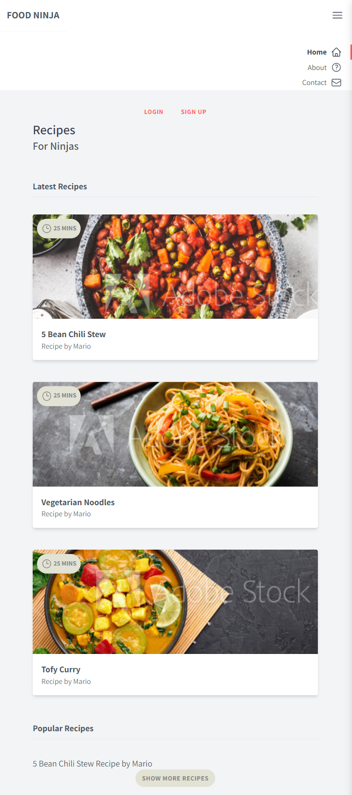

<h1 align="center">Tailwind Site</h1>

## Project Description
Creating a basic website with TailwindCSS

## Built With:
- HTML
- Tailwind

## To Run:

### Package Dependencies:
[live-server](https://www.npmjs.com/package/live-server)

### Instructions
From project root, run:
```
live-server public/
```

## Screenshots:
Responsive:


Mobile View:


## Author: Jasmine Brown
[LinkedIn](https://linkedin.com/in/jmbrown864/)